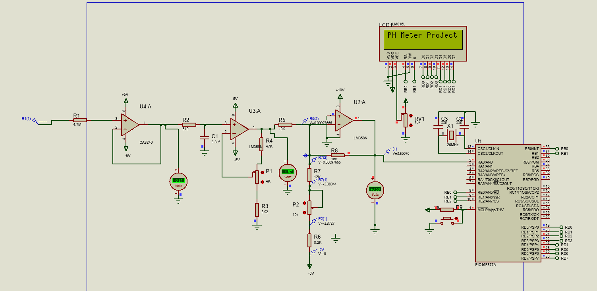
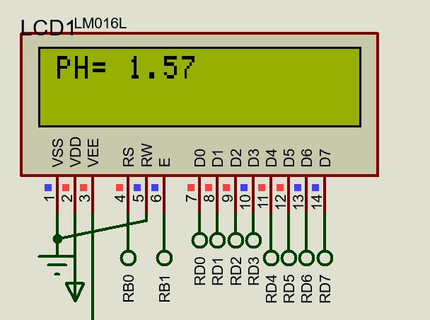

# pH-mètre Numérique avec Circuit de Conditionnement Analogique

> Projet présenté en tant qu'article IEEE à la conférence nationale **NCASEE'24**,  
> Université M'Hamed Bougara de Boumerdes, Juin 2024.

---

## Description

Conception et implémentation d'un pH-mètre numérique combinant un circuit de 
conditionnement analogique et un microcontrôleur ESP32. Le dispositif mesure 
avec précision le pH d'une solution via une électrode en verre haute impédance, 
conditionne le signal, et affiche le résultat sur un écran TFT couleur.

---

## Architecture du système

Le système est composé de quatre étages principaux :

1. **Étage buffer** — Amplificateur CA3240 en suiveur de tension (gain unitaire),  
   assure une impédance d'entrée très élevée pour interfacer la sonde pH.
2. **Étage de gain** — Mise à l'échelle du signal entre ±2V via potentiomètre P1.
3. **Étage d'offset** — Conversion du signal ±2V vers une plage 0–4V compatible  
   avec l'ADC de l'ESP32 (limité à 3.3V).
4. **Microcontrôleur ESP32** — Lecture ADC, filtrage par moyenne mobile (≈5000  
   échantillons), calcul du pH via l'équation de Nernst, affichage TFT.

---

## Composants principaux

| Composant | Rôle |
|---|---|
| Sonde E201-C BNC | Mesure du potentiel pH (0–14 pH) |
| CA3240E | Amplificateur buffer haute impédance |
| LM356N / LM358N | Étages gain et offset |
| ESP32-WROOM | Traitement numérique et affichage |
| Écran TFT 128x128 | Affichage couleur du pH mesuré |
| MAX1044 | Convertisseur de tension (génération du -5V) |

---

## Résultats de tests

| Tension d'entrée | pH mesuré | pH attendu |
|---|---|---|
| +220 mV | 3.40 | ~3.4 |
| 0 mV | 7.13 | 7.00 |
| -220 mV | 11.14 | ~11.1 |

---

## Simulation

Simulation réalisée sous **Proteus 8 (ISIS)** — ouvrir le fichier `PH_meter.pdsprj`  
avec Proteus ISIS pour visualiser et exécuter la simulation complète.

### Schéma complet

### Sortie LCD

### Prototype réel

---

## Technologies utilisées

- Proteus 8 (ISIS / ARES)
- Arduino IDE
- ESP32 (Espressif)
- Langage C (Arduino framework)

---

## Publication

Ce projet a été co-rédigé et présenté sous forme d'**article IEEE** à la conférence  
nationale **NCASEE'24** (Boumerdes, Juin 2024).

📄 [Voir le résumé du projet](docs/project_summary.pdf)  
🏆 [Certificat de participation NCASEE'24](docs/certificate_ncasee24.pdf)

---

## Auteurs

- **Marouane DAOUDI** — marouane.daoudi@outlook.com  
- Leila SADOUKI (encadrante)  
- Yacine BENGHARABI (co-auteur)
